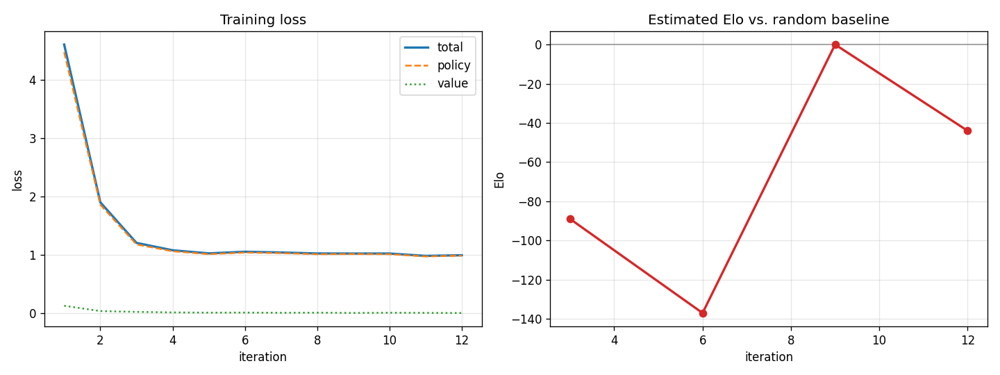

# RL-Chess-Engine

[](https://rl-chess-engine.vercel.app/)

[](https://rl-chess-engine.onrender.com/)
[](https://rl-chess-engine.vercel.app/)
[](https://github.com/Danny-397/RL-Chess-Engine/actions/workflows/tests.yml)
[](LICENSE)

**▶ Play it live:** **[rl-chess-engine.vercel.app](https://rl-chess-engine.vercel.app/)** &nbsp;·&nbsp; mirror: [onrender.com](https://rl-chess-engine.onrender.com/)

A clean, fully-documented implementation of an **AlphaZero-style reinforcement
learning chess engine**, written from scratch in **Python + PyTorch**.

The engine learns to play chess **with zero human knowledge** beyond the rules:
it starts from random weights and improves purely by playing millions of moves
against itself. The same three ideas that powered DeepMind's AlphaZero are all
here, implemented in a way meant to be *read and understood*:

1. A **deep residual neural network** that looks at a position and outputs both a
   move-preference (**policy**) and an estimate of who is winning (**value**).
2. **Monte-Carlo Tree Search (MCTS)** that uses the network to look ahead and
   produce much stronger move choices than the raw network alone.
3. A **self-play training loop** that turns those searches into training data and
   feeds the improved network back into the search — a self-reinforcing cycle.

> This project was built to be a clear, correct, end-to-end demonstration of
> reinforcement learning and search, not to chase grandmaster strength. Every
> module is small, single-purpose and heavily commented.

### What this project demonstrates

- **Reinforcement learning from scratch** — the full AlphaZero loop (network ↔ search ↔ self-play), no RL libraries.
- **Search algorithms** — PUCT Monte-Carlo Tree Search *and* a classical alpha-beta engine (negamax, quiescence, piece-square evaluation).
- **Deep learning in PyTorch** — a dual-headed residual CNN, custom loss, training loop and checkpointing.
- **Software engineering** — modular design, a 25-test suite, CI, typed config, and a deployed full-stack web app (FastAPI + a hand-built board UI).
- **Engineering judgement** — diagnosing and solving real problems under real constraints (see *Engineering decisions & challenges* below).

---

## Why this is interesting

AlphaZero is famous for being conceptually simple but subtle to get *right*. This
repo deliberately surfaces the parts that are easy to get wrong, with tests to
prove they're correct:

- **Perspective handling.** The network always sees the board from the side to
  move's point of view (the board is mirrored when it's Black's turn), and value
  signs are flipped correctly as they propagate up the search tree. A single sign
  error here silently breaks learning — so there are tests for it.
- **The full AlphaZero move encoding.** Moves are encoded into the canonical
  `8 × 8 × 73 = 4672`-dimensional action space (queen moves, knight moves and
  under-promotions), with round-trip tests.
- **Search as policy improvement.** MCTS visit counts — not the raw network
  output — are used as the training target, which is precisely what makes the
  network get stronger over time.

---

## Architecture at a glance

```
                 +-------------------+
                 |   self_play.py    |  plays the engine against itself,
                 |  (data generator) |  records (state, MCTS policy, outcome)
                 +---------+---------+
                           |  training examples
                           v
   +-----------+     +-----------+     +-------------------+
   |  mcts.py  |<----|  model.py |     |   training.py     |
   |  (search) |     | (ResNet)  |---->| (loss + optimise) |
   +-----+-----+     +-----------+     +---------+---------+
         |  uses network priors + value           |  updated weights
         |                                         v
         |                                  checkpoints/*.pt
         v
   +-------------+
   | chess_game  |  rules, board<->tensor encoding, move<->index encoding
   | (.py)       |  (built on python-chess)
   +-------------+
```

| File             | Responsibility |
|------------------|----------------|
| `config.py`      | All hyper-parameters in one typed, documented place. |
| `chess_game.py`  | Rules wrapper + board→tensor and move↔index encodings. |
| `model.py`       | The dual-headed residual policy/value network. |
| `mcts.py`        | PUCT Monte-Carlo Tree Search guided by the network. |
| `self_play.py`   | Generates `(state, policy, value)` training data via self-play (sequential **and** multiprocessing), with PGN export. |
| `training.py`    | Loss function, replay buffer, training loop, checkpointing, periodic evaluation. |
| `evaluation.py`  | Pluggable agents, match play, and an approximate **Elo** estimate. |
| `analysis.py`    | Engine move recommendations + win-probability (powers `hint`/`analyze`). |
| `main.py`        | CLI entry point: `--mode train` / `play` / `eval` / `analyze` / `serve`. |
| `web/`           | Optional FastAPI backend + chessboard.js front-end (browser play). |
| `tests/`         | Pytest suite covering encoding, model, search, self-play and evaluation. |

---

## Installation

```bash
git clone https://github.com/Danny-397/RL-Chess-Engine.git
cd RL-Chess-Engine
python -m venv .venv && source .venv/bin/activate   # optional but recommended

pip install -r requirements.txt                     # play the demo (torch-free)
pip install -r requirements-train.txt               # ALSO train the network + tests
```

Requires Python 3.10+. The playable demo (classical engine) needs only
`requirements.txt`; training the AlphaZero network and running the test suite also
need `requirements-train.txt` (PyTorch). A GPU is optional.

---

## Quick start

### Play in the browser (web UI)

The most demoable way to play: a drag-and-drop board with a live evaluation bar
and a "recommended moves" panel.

```bash
pip install -r requirements-web.txt   # python-chess + fastapi + uvicorn (no torch)
python main.py --mode serve           # then open http://127.0.0.1:8000
```

You play White by dragging pieces; the engine replies, the **Hint** button asks
it to recommend moves for your position, the eval bar tracks who's ahead, and a
banner announces checkmate/draw. The backend is stateless (the browser sends the
position as FEN).

> **Which engine plays you:** the web/console demo uses the **classical alpha-beta
> searcher** ([`search.py`](search.py)) — material + endgame mop-up evaluation,
> quiescence and capture ordering. It plays genuinely sound chess (captures, avoids
> blunders, *converts* won positions into checkmate — it beats the random baseline
> 10/0) and needs **no PyTorch**. The AlphaZero network + MCTS is the *learning*
> project (trained via the [Colab notebook](#training-results-and-an-honest-note-on-scale));
> it's kept separate because an untrained network can't yet play well. Tune the
> searcher's strength with `--depth` (CLI) or `RLCHESS_DEPTH` (server); 3 is snappy,
> 4 is stronger.

> **Play the actual neural network (in your browser):** the web UI has an
> **Opponent** toggle — *Classical* or *AlphaZero net*. The latter runs the trained
> network **client-side via [onnxruntime-web]**, with no PyTorch backend: it loads
> `web/static/model.onnx` and chooses moves by a 1-ply value search. To enable it,
> export the model with the last cell of the Colab notebook (or `export_onnx.py` on a
> machine where `onnx` installs), drop `model.onnx` into `web/static/`, and redeploy.
> A built-in self-check verifies the JS board-encoding matches Python before use;
> if the file or check is missing it silently falls back to the classical engine.
> (It plays *loosely* — it's the still-learning network.)

[onnxruntime-web]: https://onnxruntime.ai/docs/tutorials/web/

#### Deploy the web UI to Render (one lightweight service)

Because the demo engine is torch-free, the whole site — board **and** API — runs
as a single tiny service that fits Render's free tier. A [`render.yaml`](render.yaml)
blueprint is included:

1. Push this repo to GitHub (already done if you cloned it from there).
2. On [Render](https://render.com): **New + → Blueprint**, pick this repo, **Apply**.
3. Open the URL Render gives you and play. That URL is the complete site.

Or configure a **Web Service** manually:

| Setting | Value |
|---|---|
| Build command | `pip install --upgrade pip && pip install -r requirements-web.txt` |
| Start command | `uvicorn web.server:app --host 0.0.0.0 --port $PORT` |
| Env var | `RLCHESS_DEPTH=3` (4 = stronger, slower) |

The blueprint binds `0.0.0.0:$PORT` (Render injects `$PORT`; the local default is
`127.0.0.1:8000`) and exposes a `/health` endpoint for the readiness check.

#### Deploy the whole app to Vercel

Because the demo engine is torch-free and tiny, the **entire site (board + API)
now runs on Vercel** as a Python serverless function — no split, no separate
backend. The repo is preconfigured for it:

- [`api/index.py`](api/index.py) exports the FastAPI app as the serverless function;
- [`vercel.json`](vercel.json) routes every request to it and bundles `web/static`;
- the root [`requirements.txt`](requirements.txt) is torch-free, so the function
  installs in seconds and stays well under Vercel's size limit;
- [`.vercelignore`](.vercelignore) keeps the training stack out of the bundle.

To deploy: on [Vercel](https://vercel.com), **Add New → Project**, import this
repo, and **Deploy** (no settings to change). Open the URL and play.

> This is why the earlier *"main.py does not define a top-level app"* error
> happened — Vercel was trying to build the **old PyTorch** backend, which was far
> too big for a serverless function. With the lightweight engine and `api/index.py`
> exporting `app`, that's resolved.

### Play against the engine (console)

Play the classical engine straight away (no checkpoint or torch needed):

```bash
python main.py --mode play            # add --depth 4 for a stronger opponent
```

You enter moves in standard algebraic notation (`e4`, `Nf3`, `O-O`, `exd5`,
`e8=Q`). During your turn you can also type:

- **`hint`** — the engine analyses *your* position and prints its top recommended
  moves (ranked by search effort) plus your win probability;
- **`eval`** — show the engine's evaluation of the current position;
- `board` to redraw, `quit` to resign.

The engine also reports its own win estimate each time it moves.

> The bundled checkpoint is trained only briefly (it's a *demonstration*, not a
> strong player). Train longer for a tougher opponent.

### Analyse any position

Get the engine's evaluation and recommended moves for a position without playing
a whole game — defaults to the opening, or pass any FEN:

```bash
python main.py --mode analyze --checkpoint checkpoints/best.pt
python main.py --mode analyze --fen "r1bqkbnr/pppp1ppp/2n5/4p3/4P3/5N2/PPPP1PPP/RNBQKB1R w KQkq - 0 1" --top-n 5
```

Example output:

```
Engine eval: +0.18  (win probability for side to move: 59%)
Recommended moves:
  1. Nf3      62% of search, eval +0.18
  2. e4       21% of search, eval +0.12
  3. d4       11% of search, eval +0.09
```

### Train your own engine

```bash
# A short demo run (minutes on a CPU):
python main.py --mode train --iterations 5 --games 4 --simulations 50

# A more serious run (uses the defaults in config.py):
python main.py --mode train
```

Checkpoints are written to `checkpoints/` and progress is logged to
`logs/training.log`. The final model is saved as `checkpoints/best.pt`, which is
the default the `play` mode looks for.

#### Faster training: parallel self-play

Self-play (not the gradient updates) dominates AlphaZero's runtime, and games are
independent — so they fan out across CPU cores almost perfectly:

```bash
python main.py --mode train --workers 8        # 8 self-play worker processes
```

Workers each rebuild the network from the current weights and run on CPU (pinned
to one thread each to avoid oversubscription); their `(state, policy, value)`
examples are collected back in the main process for the gradient step.

#### Archiving games + tracking strength during training

```bash
# Save every self-play game to pgn/selfplay_iterNNN.pgn, and every 5 iterations
# play a quick match vs a random baseline and log the estimated Elo gain:
python main.py --mode train --save-pgn --eval-every 5
```

### Measure engine strength (Elo)

The `eval` mode plays a match and reports a win/draw/loss tally plus an
approximate Elo difference (colours are alternated so first-move advantage
cancels out):

```bash
# Trained engine vs. the random baseline (the basic "did it learn?" test):
python main.py --mode eval --checkpoint checkpoints/best.pt --opponent random --eval-games 40

# Head-to-head between two checkpoints (did training iteration N beat iteration M?):
python main.py --mode eval --checkpoint checkpoints/checkpoint_iter020.pt \
                           --opponent checkpoints/checkpoint_iter010.pt --eval-games 40

# Optionally dump the played games to a PGN file with --pgn-out games.pgn
```

Elo is derived from the expected score `S` by the standard logistic relation
`elo = -400 · log10(1/S − 1)`, so 50% → ±0, ~64% → ~+100, etc.

### Run the tests

```bash
pytest -q
```

The same suite runs automatically on every push via GitHub Actions (see the
`tests` badge above).

### Tracking training progress

Training appends a per-iteration loss breakdown to `logs/training.log`, plus a
periodic Elo estimate against the random baseline. Turn that log into charts:

```bash
python plot_progress.py            # -> assets/training_progress.png
```

This produces two plots — training loss over time, and estimated Elo vs. random
over time — which together answer the only questions that matter: *is the network
fitting the data, and is the engine actually getting stronger?*

### Training results (and an honest note on scale)

Below is a real **GPU (Colab)** training run — 12 iterations, ~96 self-play games:



The **policy loss drops sharply** (4.6 → ~1.0): the network rapidly learns to imitate
its own search — clear evidence the RL machinery works. But, being honest about what
the numbers show:

1. The **value loss collapses toward zero**, and
2. the engine still only **draws the random baseline** (it went +0 =8 across the last
   eval — the small Elo wiggle is just one game's noise, not a real strength gain).

Both have the same cause — a **draw cycle**. A still-weak network can't *convert*, so
its self-play games run long and end in draws; the value target is therefore almost
always `0`, the value head learns only to predict "even," and the search stays weak.
Escaping it needs **far more self-play than a short run provides** — AlphaZero used
*millions* of games; this run played under a hundred. The learning *mechanism* is
correct and visible; reaching strength is a compute story, not an algorithm one.

> This is exactly why the **live demo plays via the classical alpha-beta engine** — it
> gives a genuinely strong opponent today, while the neural network above remains the
> from-scratch *learning* project.

**To train a genuinely strong engine**, run on a GPU with more self-play. A ready-made
Colab notebook does exactly this on free, dedicated compute (so it won't crash from a
laptop's memory pressure or stall when the machine sleeps):

[](https://colab.research.google.com/github/Danny-397/RL-Chess-Engine/blob/main/notebooks/train_on_colab.ipynb)

It clones the repo, trains with deeper search and more games per iteration, plots the
learning curves, measures Elo vs. random, and lets you download the trained checkpoint to
drop in as `checkpoints/example_checkpoint.pt`. The learning machinery here is correct and
complete — the limiting factor is raw compute, not the algorithm.

---

## How it works (the 3-minute version)

> For a fuller treatment with the underlying math (PUCT, the loss function, and
> why the self-play loop converges), see [docs/how-it-works.md](docs/how-it-works.md).

**1. The network (`model.py`).** A small ResNet takes an `18 × 8 × 8` tensor of
the position and produces a policy (4672 logits, one per possible move) and a
scalar value in `[-1, 1]`. Sharing a trunk between the two heads is multi-task
learning: features useful for *choosing* a move also help *judging* a position.

**2. The search (`mcts.py`).** Pure neural-network move choice is short-sighted.
MCTS runs many simulations, each descending the game tree by the **PUCT** rule

```
score(move) = Q(move) + c_puct · P(move) · √N(parent) / (1 + N(move))
```

which balances exploiting moves with a high running value `Q` against exploring
moves the network rates highly (`P`) but hasn't tried much. Leaves are evaluated
by the network's value head (no random rollouts), and the value is backed up the
tree, flipping sign each ply because the players alternate.

**3. Self-play & training (`self_play.py`, `training.py`).** The engine plays
itself; for each position it stores the board, the MCTS visit distribution (a
*sharpened* policy), and — once the game ends — who won. The network is then
trained to match those policies (cross-entropy) and outcomes (MSE):

```
loss = −Σ π · log p(·)   +   c · (z − v)²   +   L2 regularisation
```

A stronger network produces stronger self-play, which produces better data, which
produces a stronger network. That loop is the whole idea.

---

## Extending it

The code is built to be tinkered with:

- **Different network?** Edit `model.py` (or swap in your own `nn.Module` that
  returns `(policy_logits, value)`). Adjust depth/width in `config.NetworkConfig`.
- **Stronger / faster search?** Change `num_simulations` and `c_puct` in
  `config.MCTSConfig`.
- **Training behaviour?** Everything (learning rate, batch size, games per
  iteration, replay buffer size, temperature schedule) lives in
  `config.TrainingConfig`.

---

## Engineering decisions & challenges

The interesting part of a project is rarely the happy path. A few real problems
this one ran into, and how they were solved:

- **The "draw cycle."** An *under-trained* network + MCTS won material but couldn't
  convert — it shuffled winning positions into threefold-repetition draws (it drew
  the random baseline 50%). Diagnosing this (logging *why* each game ended) showed
  the value head only ever saw drawn outcomes, so it never learned what *winning*
  looked like. **Decision:** for the playable demo, add a dependency-light classical
  **alpha-beta engine** (`search.py`) that plays sound chess *today* (it beats the
  random baseline 10–0), while keeping the neural network + MCTS as the learning
  project. Two engines, each used where it's strongest.
- **"Weird" openings.** The alpha-beta engine first only valued material, so every
  opening move scored 0 and it played randomly (knights to the rim, rook shuffles).
  **Fix:** piece-square tables — now it develops toward the centre and castles
  sensibly, with no training required.
- **Converting won endgames.** Material alone can't deliver mate. **Fix:** an
  endgame "mop-up" evaluation (drive the lone king to a corner, shrink its escape
  squares) plus scoring repetition/stalemate as 0 — so the engine seeks the
  *fastest* mate instead of stalling.
- **Memory limits.** Training crashed with `OpenBLAS`/paging errors when parallel
  self-play spawned many PyTorch workers on a small machine, and orphaned worker
  processes piled up. **Fixes:** cap BLAS threads before importing numpy, and fall
  back to sequential self-play when memory is tight.
- **Deployability.** A PyTorch web service is too big for free serverless/instances
  (the multi-GB CUDA wheel, the 250 MB serverless limit). **Decision:** because the
  demo engine is *torch-free*, the deployed app needs only `python-chess` + FastAPI
  — a tiny service that runs on a free tier and even fits a Vercel function.
- **Reproducibility.** A search with hidden randomness is impossible to debug, so
  MCTS is deterministic without exploration noise — and there's a test that proves
  it.

## Roadmap

- Train the network to real strength on a GPU (a one-click [Colab notebook](notebooks/train_on_colab.ipynb)
  is included) and publish the Elo-vs-iterations curve.
- Let the live demo optionally play the *trained network* alongside the classical engine.
- Batched MCTS leaf evaluation to make GPU self-play far faster.
- Add move-history planes to the board encoding (full AlphaZero repetition handling).

---

## Limitations & honest notes

- This is an **educational** engine. With modest simulation counts and a small
  network it will not approach strong engines like Stockfish or Leela.
- Self-play (not the network) dominates runtime, the usual AlphaZero bottleneck.
  Multiprocessing self-play (`--workers`) addresses this on a single machine; the
  next step up would be distributing self-play across multiple machines.
- For clarity the board encoding omits move-history planes (used by the original
  AlphaZero to detect repetitions); this is a documented simplification.

---

## References

- Silver et al., *“A general reinforcement learning algorithm that masters chess,
  shogi, and Go through self-play”*, Science 2018 (AlphaZero).
- Silver et al., *“Mastering the game of Go without human knowledge”*, Nature 2017
  (AlphaGo Zero).
