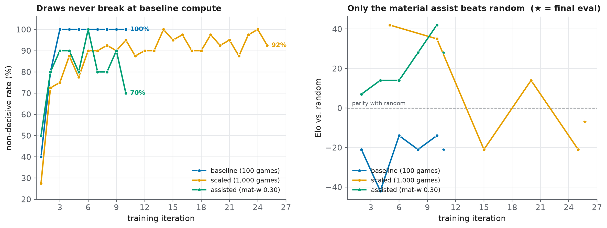
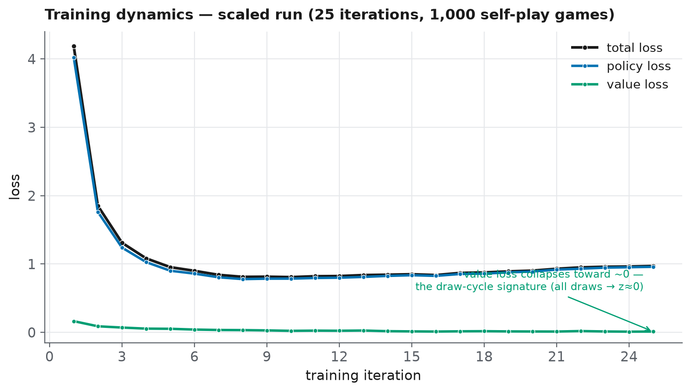

# Draw-Cycle Experiment Results

**Hardware:** Kaggle, 2× Tesla T4 (GPU) · **Driver:** `python run_experiment.py --device cuda`
**Date:** 2026-07-14 · **Training wall-clock:** ~9.8 h (baseline 68.9 min + scaled 444.7 min + assisted 75.2 min)

> **Provenance.** The Kaggle notebook's automatic `git push` failed with a 403 (its
> `GITHUB_TOKEN` secret lacked write scope), so every number in this file is
> transcribed directly from that run's captured stdout — the per-iteration
> self-play termination tables, the periodic evaluation lines, and the loss curve.
> Two things could **not** be recovered from the surviving logs and are marked where
> they appear: (1) the win/draw/loss split of each stage's *final* stand-alone
> 50-game evaluation (only its Elo survived), and (2) a downloadable trained
> checkpoint, which was lost with the Kaggle session (re-run the driver to
> regenerate one). The figures below are plotted directly from the per-iteration
> numbers transcribed in this file.



## Run configuration

All three stages share the identical code and network (4 residual blocks, 64
channels); they differ only in the variable under test.

| Stage | Iterations | Games/iter | Total games | Sims/move | Self-play material w |
|---|---|---|---|---|---|
| baseline | 10 | 10 | 100 | 100 | 0.00 |
| scaled | 25 | 40 | 1,000 | 160 | 0.00 |
| assisted | 10 | 10 | 100 | 100 | 0.30 |

Evaluation at each checkpoint is 50 games vs. `RandomAgent` at 50 sims/move.

---

## Headline results

The driver's two headline metrics are the self-play **non-decisive rate** (fraction
of games *not* ending in checkmate) and **Elo vs. random**. "Non-decisive rate"
below is the **final iteration's** rate (the end-of-training state); the aggregate
over *all* of a stage's games is given alongside because for the baseline the two
differ sharply (see §A).

### Experiment A — compute scaling (material w = 0 in both)

| Run | Total games | Sims/move | Non-decisive (final iter / all games) | Elo vs random |
|---|---|---|---|---|
| baseline | 100 | 100 | 100% / 92% | −21 |
| scaled | 1,000 | 160 | 92% / 88% | −7 |

**Result.** 10× the self-play raises Elo (−21 → −7) and produces more checkmates in
aggregate (8/100 = 8% → 120/1000 = 12%), but the cycle is not broken: the network
still cannot reliably convert, and Elo stays negative.

### Experiment B — self-play signal at fixed compute (same budget as baseline)

| Run | Total games | Sims/move | Material w | Non-decisive (final iter / all games) | Elo vs random |
|---|---|---|---|---|---|
| baseline | 100 | 100 | 0.00 | 100% / 92% | −21 |
| assisted | 100 | 100 | 0.30 | 70% / 81% | +28 |

**Result.** Blending a 0.30 material term into self-play leaf evaluation — at the
*same* compute as the baseline — drops the final-iteration non-decisive rate to 70%,
raises the aggregate checkmate count to 19/100, and flips Elo from −21 to **+28**.
The engine now beats random. This is the more cost-effective lever.

### Reading the two together
Both levers move the metrics, so the plateau is driven by **both** limited compute
*and* an impoverished self-play signal (the "yes | yes" row of the §5.3 reading
matrix) — but the signal lever does more per unit of compute.

---

## A. Per-iteration self-play termination

Counts are games ending by each reason. **CM** checkmate · **ST** stalemate ·
**INSUF** insufficient material · **REP** threefold repetition · **50M** fifty-move ·
**CAP** hit the `max_moves = 200` cap. "Non-dec %" = fraction not won by checkmate.

### Baseline — 10 iters × 10 games, 100 sims, mat-w 0.00

| Iter | CM | ST | INSUF | REP | 50M | CAP | Non-dec % |
|---|---|---|---|---|---|---|---|
| 1 | 6 | 0 | 0 | 0 | 0 | 4 | 40% |
| 2 | 2 | 0 | 0 | 8 | 0 | 0 | 80% |
| 3 | 0 | 0 | 0 | 10 | 0 | 0 | 100% |
| 4 | 0 | 0 | 0 | 10 | 0 | 0 | 100% |
| 5 | 0 | 0 | 0 | 10 | 0 | 0 | 100% |
| 6 | 0 | 0 | 0 | 10 | 0 | 0 | 100% |
| 7 | 0 | 0 | 0 | 10 | 0 | 0 | 100% |
| 8 | 0 | 0 | 0 | 10 | 0 | 0 | 100% |
| 9 | 0 | 0 | 0 | 10 | 0 | 0 | 100% |
| 10 | 0 | 0 | 0 | 10 | 0 | 0 | 100% |
| **ALL** | **8** | 0 | 0 | **88** | 0 | **4** | **92%** |

*The draw cycle forming in real time: the early, near-random network scores a few
accidental checkmates (8 in iters 1–2), then collapses into pure threefold
repetition from iter 3 onward — zero checkmates for the last 80 games. Draws are
driven by **repetition**, not the fifty-move rule.*

### Scaled — 25 iters × 40 games, 160 sims, mat-w 0.00

| Iter | CM | ST | INSUF | REP | 50M | CAP | Non-dec % |
|---|---|---|---|---|---|---|---|
| 1 | 29 | 0 | 0 | 0 | 0 | 11 | 27.5% |
| 2 | 11 | 0 | 0 | 29 | 0 | 0 | 72.5% |
| 3 | 10 | 0 | 0 | 30 | 0 | 0 | 75.0% |
| 4 | 5 | 0 | 0 | 34 | 0 | 1 | 87.5% |
| 5 | 9 | 0 | 0 | 31 | 0 | 0 | 77.5% |
| 6 | 4 | 0 | 0 | 36 | 0 | 0 | 90.0% |
| 7 | 4 | 0 | 0 | 36 | 0 | 0 | 90.0% |
| 8 | 3 | 0 | 0 | 37 | 0 | 0 | 92.5% |
| 9 | 4 | 0 | 0 | 35 | 0 | 1 | 90.0% |
| 10 | 2 | 0 | 0 | 38 | 0 | 0 | 95.0% |
| 11 | 5 | 0 | 0 | 35 | 0 | 0 | 87.5% |
| 12 | 4 | 0 | 0 | 36 | 0 | 0 | 90.0% |
| 13 | 4 | 0 | 0 | 36 | 0 | 0 | 90.0% |
| 14 | 0 | 0 | 0 | 39 | 0 | 1 | 100.0% |
| 15 | 2 | 0 | 0 | 38 | 0 | 0 | 95.0% |
| 16 | 1 | 0 | 0 | 39 | 0 | 0 | 97.5% |
| 17 | 4 | 0 | 0 | 36 | 0 | 0 | 90.0% |
| 18 | 4 | 0 | 0 | 36 | 0 | 0 | 90.0% |
| 19 | 1 | 0 | 0 | 39 | 0 | 0 | 97.5% |
| 20 | 3 | 0 | 0 | 37 | 0 | 0 | 92.5% |
| 21 | 2 | 0 | 0 | 38 | 0 | 0 | 95.0% |
| 22 | 5 | 0 | 0 | 35 | 0 | 0 | 87.5% |
| 23 | 1 | 0 | 0 | 39 | 0 | 0 | 97.5% |
| 24 | 0 | 0 | 0 | 40 | 0 | 0 | 100.0% |
| 25 | 3 | 0 | 0 | 37 | 0 | 0 | 92.5% |
| **ALL** | **120** | 0 | 0 | **866** | 0 | **14** | **88%** |

*Same pattern at scale: iter 1's untrained net delivers 29 accidental mates, then
the rate settles into the high-80s/90s% non-decisive band for the rest of training.
More compute keeps a *residual* trickle of checkmates alive (120/1000 aggregate vs.
the baseline's 8/100) but does not escape the plateau.*

### Assisted — 10 iters × 10 games, 100 sims, mat-w 0.30

| Iter | CM | ST | INSUF | REP | 50M | CAP | Non-dec % |
|---|---|---|---|---|---|---|---|
| 1 | 5 | 0 | 2 | 1 | 0 | 2 | 50% |
| 2 | 2 | 0 | 0 | 7 | 0 | 1 | 80% |
| 3 | 1 | 0 | 0 | 9 | 0 | 0 | 90% |
| 4 | 1 | 0 | 0 | 9 | 0 | 0 | 90% |
| 5 | 2 | 0 | 0 | 8 | 0 | 0 | 80% |
| 6 | 0 | 0 | 0 | 10 | 0 | 0 | 100% |
| 7 | 2 | 0 | 0 | 7 | 0 | 1 | 80% |
| 8 | 2 | 0 | 0 | 7 | 0 | 1 | 80% |
| 9 | 1 | 0 | 0 | 9 | 0 | 0 | 90% |
| 10 | 3 | 0 | 0 | 7 | 0 | 0 | 70% |
| **ALL** | **19** | 0 | **2** | **74** | 0 | **5** | **81%** |

*With the material assist, checkmates keep appearing throughout training instead of
dying out — 19/100 aggregate, and the final iteration hits 30% checkmate (70%
non-decisive), the best of any stage. Decisive games give the value head a real
signal to learn from.*

---

## B. Elo vs. random — periodic evaluation checkpoints

Each row is an independent 50-game match vs. `RandomAgent` (50 sims/move), logged
during training at the stage's `eval_every` interval. W/D/L are the raw counts.

### Baseline (every 2 iters)

| Iter | W | D | L | Score | Elo |
|---|---|---|---|---|---|
| 2 | 2 | 43 | 5 | 47.0% | −21 |
| 4 | 0 | 44 | 6 | 44.0% | −42 |
| 6 | 3 | 42 | 5 | 48.0% | −14 |
| 8 | 1 | 45 | 4 | 47.0% | −21 |
| 10 | 2 | 44 | 4 | 48.0% | −14 |

### Scaled (every 5 iters)

| Iter | W | D | L | Score | Elo |
|---|---|---|---|---|---|
| 5 | 8 | 40 | 2 | 56.0% | +42 |
| 10 | 8 | 39 | 3 | 55.0% | +35 |
| 15 | 0 | 47 | 3 | 47.0% | −21 |
| 20 | 6 | 40 | 4 | 52.0% | +14 |
| 25 | 3 | 41 | 6 | 47.0% | −21 |

### Assisted (every 2 iters)

| Iter | W | D | L | Score | Elo |
|---|---|---|---|---|---|
| 2 | 6 | 39 | 5 | 51.0% | +7 |
| 4 | 6 | 40 | 4 | 52.0% | +14 |
| 6 | 5 | 42 | 3 | 52.0% | +14 |
| 8 | 7 | 40 | 3 | 54.0% | +28 |
| 10 | 10 | 36 | 4 | 56.0% | +42 |

**Final stand-alone evaluation** (a separate 50-game match after training; only the
Elo survives in the logs — the W/D/L split was not captured):
baseline **−21**, scaled **−7**, assisted **+28**. These are the headline Elo
figures above. Note they differ from each stage's *last periodic* checkpoint (e.g.
scaled's iter-25 checkpoint read −21 but its final match read −7) — independent
50-game samples of a near-even engine are noisy, which is itself worth reporting.

---

## C. Training loss



Total loss = policy cross-entropy + value MSE. Start (iter 1) → end (final iter):

| Stage | Policy loss (start → end) | Value loss (start → end) | Total (start → end) |
|---|---|---|---|
| baseline | 4.54 → 0.81 | 0.092 → 0.006 | 4.63 → 0.81 |
| scaled | 4.02 → 0.96 | 0.164 → 0.012 | 4.19 → 0.97 |
| assisted | 4.37 → 0.69 | 0.101 → 0.023 | 4.47 → 0.71 |

*Policy loss falls sharply in every stage — the network readily learns to imitate
its own MCTS visit distribution. The **value loss is tiny from the start and shrinks
toward ≈0.01**: with almost every game drawn, the outcome target `z ≈ 0` nearly
everywhere, so the value head has almost nothing to fit. That collapse is the
draw-cycle signature (technical report §6), not a training success.*

---

## Key findings

1. **The draw cycle is real and self-reinforcing.** At baseline compute the
   near-random network scores a few accidental mates in iters 1–2, then collapses to
   100% repetition draws from iter 3 on — the value target flattens to ≈0 and the
   cycle locks in.
2. **Compute helps, but does not break it.** 10× the self-play (100 → 1,000 games)
   lifts Elo (−21 → −7) and keeps a residual checkmate rate alive (8% → 12%
   aggregate), yet Elo stays negative and the non-decisive rate stays in the high
   80s/90s%.
3. **Signal quality is the more efficient lever.** `material_weight = 0.30` in
   self-play — at the *same* baseline compute — drops the final-iteration
   non-decisive rate to 70%, keeps checkmates appearing throughout training
   (19/100 aggregate), and flips Elo to **+28**. The engine beats random.
4. **Both effects compound** ("yes | yes" in the §5.3 reading matrix): compute helps
   *and* signal helps. A combined scaled-plus-assisted run is the natural next step.
5. **`material_weight = 0.30` is the recommended self-play default**, now set via
   `MCTSConfig.material_weight` and exposed as `run_experiment.py --assist-weight`.

---

## Reproducibility

```bash
# All three stages on a GPU (this run):
python run_experiment.py --device cuda

# Fast pipeline check on CPU (~1–2 min, results not meaningful):
python run_experiment.py --quick
```

Config used (from `config.py`; stages differ only in iterations/games/sims and the
self-play material weight noted above):

- Network: `num_residual_blocks = 4`, `num_channels = 64`
- Search: `c_puct = 1.5`, `dirichlet_alpha = 0.3`, `dirichlet_epsilon = 0.25`
- Self-play: `temperature_moves = 15`, `max_moves = 200`
- Training: `epochs_per_iteration = 4`, `batch_size = 64`,
  `learning_rate = 1e-3`, `weight_decay = 1e-4`, `replay_buffer_size = 20 000`
